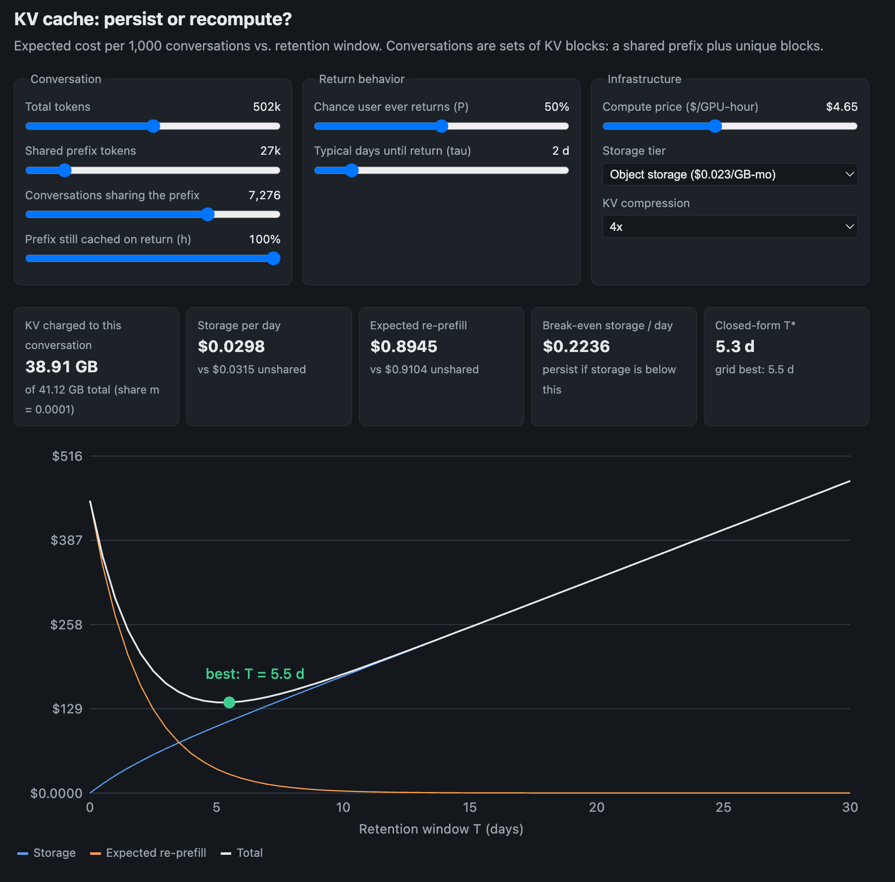

# tensor-caching

An interactive cost model for one narrow question: **for an idle LLM conversation, is it cheaper to keep a cold-cache, or to delete it and re-prefill if the user comes back?**

Note: The fundamental object in the model is a **KV block**, not a conversation. A conversation's retained state is a set of blocks: some are **shared** with many other conversations (system prompt, tool definitions, common skills, RAG documents, agent scaffolding), and some are **unique** to that conversation. The token economics follow from that split.

The widget plots expected cost per 1,000 archived conversations against how long you retain the KV cache, and marks the sweet spot (or tells you there isn't one).

[](output.png)

> **TL;DR: Persist when the daily *effective* storage cost is less than the expected daily avoided *effective* recompute cost.**

```
effective_bytes = unique_bytes + shared_bytes x marginal_share
```

This replaces the single-conversation shortcut `tokens x bytes_per_token`, which is correct only when nothing is shared.

## Background: What is a KV cache?

A transformer processes a conversation as a sequence of tokens. At each layer, every token's hidden state (its intermediate activations) is projected into three vectors: a **query**, a **key**, and a **value**. Attention works by having each new token's query compare against the keys of all earlier tokens, then use those scores to blend their values.

The keys and values of earlier tokens never change once computed, so the model saves them instead of recomputing them. That saved set of tensors is the **KV cache**. It is not part of the model's weights. It is state derived from the tokens that came before.

Serving a request happens in two phases:

- **Prefill:** the model reads the whole prompt (system prompt, history, new message) in parallel and builds the KV cache for every token at every layer. This is compute-heavy and its cost grows faster than linearly with context length.
- **Decode:** the model generates one token at a time, reading the cache and appending one new key and value per layer per step. This is memory-bandwidth-bound.

**How big is it?** The cache holds a key and a value for every token, at every layer, for every KV head. Its size is therefore linear in token count:

```
bytes per token = 2 (K and V) x layers x KV heads x head dim x bytes per element
```

For a Llama-3-70B-class model in fp16 that is 2 x 80 x 8 x 128 x 2 = **327,680 bytes per token**. A 128k-token conversation is roughly 42 GB uncompressed, or about 10 GB at 4x compression. That is why this question is worth modeling: the cache is large, and it is expensive both to store and to rebuild.

**Why does it matter when a conversation goes idle?** GPU memory is scarce, so a conversation's cache is normally evicted soon after its last turn. When the user comes back, the server must either rebuild the cache with another prefill, or load a previously saved copy from slower storage (CPU memory, disk, object storage). This repo models that trade-off.

## Background: Why blocks, not conversations?

Modern serving systems store the KV cache in fixed-size **blocks** (for example 16 tokens each) and identify each block by a hash of its tokens *and everything before them*. Because a token's keys and values depend on the whole prefix, two requests can reuse a block only if they share an identical prefix up to and including that block.

That makes the set of all cached blocks a **prefix tree**. A conversation is a path from the root to a leaf:

```
[system prompt][tools][skills]  <- shared by thousands of conversations
                              \-- [RAG docs A][turns...]   <- conversation 1
                              \-- [RAG docs B][turns...]   <- conversation 2
                              \-- [turns...]               <- conversation 3
```

So a conversation's retained state is:

```
shared prefix blocks  +  conversation-specific blocks
```

For a consumer chat workload, the shared part is small and per-conversation model is a fine approximation. For an enterprise workload with a giant common system prompt, tool definitions, RAG documents, or agent scaffolding, the shared part can dominate. The expensive portion of the cache may already be resident and reusable across many requests, so the cost of keeping, or rebuilding, one more conversation looks very different.

## Audience: Who is this for?

This is a back-of-envelope tool for building intuition, aimed at people making or reasoning about LLM serving decisions:

- **ML platform engineers** deciding whether a KV persistence tier is worth building, and whether prefix sharing changes the answer
- **Managers and stakeholders** who need a rough sense of the cost and latency trade-offs.
- **Researchers** who want a concrete, inspectable example of the compute-versus-storage trade-off in LLM serving

It is **not** a capacity-planning or billing tool. It assumes a single Llama-3-70B-class model shape and idealized pricing, and it has not been validated against production traffic. Sharing parameters (how many conversations share a prefix, how often the shared prefix is still resident) are inputs you supply, not quantities the tool simulates. Replace the constants in `js/config.js` with your own measurements before trusting the output for a real decision.

A basic familiarity with LLM inference is helpful. You do not need to know transformer internals beyond the refresher above.

## How the caching model works

When a conversation goes idle, you can either **delete** its KV blocks and re-prefill if the user returns, or **persist** them for up to `T` days and load them instead. The widget finds the `T` that minimizes expected cost per conversation. `T = 0` means "always re-prefill."

**Inputs:**

- Conversation length (`n` tokens) and how much of it is a shared prefix (`p` tokens)
- How widely the shared prefix is shared (`n_s` conversations per shared block, which sets `marginal_share`)
- Probability the shared prefix is still resident when the user returns (`h`)
- The chance the user ever returns (`P`) and the typical time until return (`tau`)
- A storage tier (price, bandwidth, latency), KV compression (1x/2x/4x), and GPU price

**Costs:**

- **Storage** is effective KV size x price per GB-month. Effective size is `unique_bytes + shared_bytes x marginal_share`, where bytes come from tokens x bytes per token (327,680 for a Llama-3-70B-class fp16 model), divided by compression.
- **Re-prefill** is prefill time x the hourly price of a full 8-GPU node. If the shared prefix is still resident, only the unique suffix needs prefilling. The expected cost is `C(n) - h x C(p)`.
- **Return behavior:** with probability `P` the user returns after an exponentially distributed delay (mean `tau`). Otherwise they never come back and you pay storage for the full window.

**Expected cost** for a window `T` has the same form as before, with effective quantities:

```
total(T) = c_eff * (P*tau*(1 - e^(-T/tau)) + (1 - P)*T)  +  P * e^(-T/tau) * C_eff
```

where `c_eff` is effective storage cost per day and `C_eff` is expected effective re-prefill cost.

**Rule of thumb:** a closed-form optimum exists, and retention pays only if `c_eff < P x C_eff / tau`. Sharing moves both sides of that inequality, and not by the same factor, so it can tip the decision either way. The widget also reports the latency a returning user saves, and says so when loading isn't faster than re-prefilling.

### A worked example

An enterprise assistant with a 30k-token shared prefix (system prompt, tools, skills) and 10k tokens unique to each conversation. 4x KV compression, 1,000 conversations sharing the prefix, a 95% chance the prefix is still resident on return, `P = 40%`, `tau = 2` days, and an illustrative $0.02 per GB-month storage price.

| | Single-conversation model | Block model |
| --- | --- | --- |
| Bytes charged to this conversation | 3.28 GB | 0.82 GB |
| Storage cost per day | $0.00218 | $0.00055 |
| Re-prefill cost on return | $0.0157 | $0.0050 |
| Break-even (`P x C / tau`) per day | $0.00315 | $0.00100 |
| Storage / break-even | 0.69 | 0.55 |

Storage cost falls about 4x while recompute cost falls about 3x, so retention gets somewhat more attractive. Different splits and hit rates can push the other way. See [`docs/methodology.md`](docs/methodology.md) for the arithmetic.

**Validation:** unit tests check the code against the closed-form optimum and a brute-force search. These confirm the implementation matches the equations, not that the equations match real traffic.

**Key simplifications:** sharing is prefix-only and exact-match; `n_s` and `h` are supplied rather than simulated; exponential return times; a flat average GPU price; no queueing; linear storage billing; free KV loading; a single model shape; and a 30-day cap on the window.

Full derivations and the complete assumptions list are in [`docs/methodology.md`](docs/methodology.md).

## View it in a browser

No build step and no internet connection are needed. The chart is drawn as inline SVG, so the page has no runtime dependencies.

**Option 1: open the file directly**

Double-click `index.html`, or from a terminal:

```
# macOS
open index.html
# Linux
xdg-open index.html
# Windows (PowerShell)
start index.html
```

**Option 2: serve it locally** (use this if your browser blocks something on `file://`, or you want to click through to the docs as rendered files)

```
python3 -m http.server 8000
# then visit http://localhost:8000
```

or, with Node:

```
npx serve .
```

## Run the tests

Requires Node 18 or newer. There are no dependencies to install.

```
node --test
```

The tests check the cost model against its own closed-form optimum and against a brute-force search.